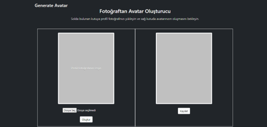
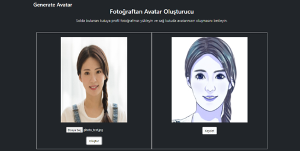

# Generate Avatar Frontend

A web-based interface has been created for the user. Through the interface, the user will be able to upload photos and view the avatar created from the uploaded photo.

In this part of the application, the frontend has been developed. It is programmed with the front-end React library.

